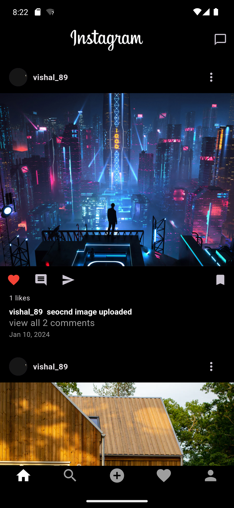
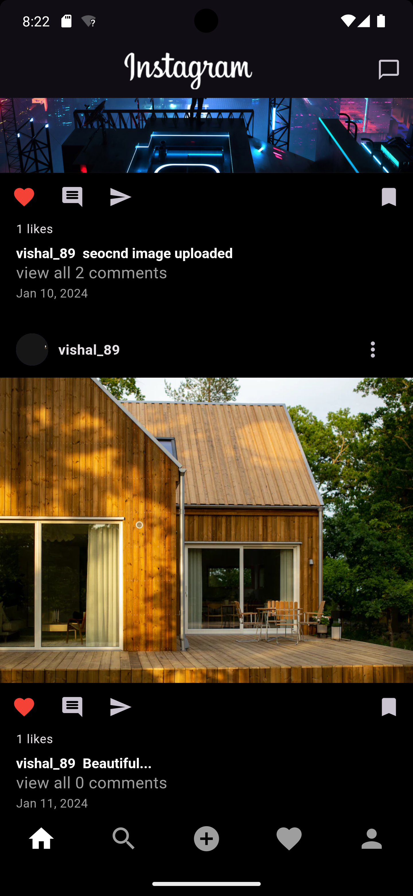
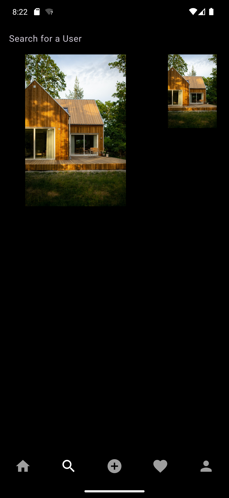
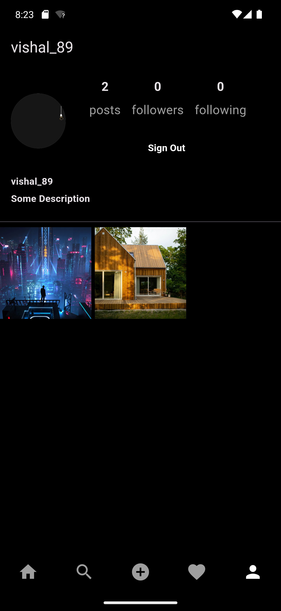

# 📖📖 Instagram(Flutter App) 

Instagram Flutter clone 

 

 

  Please star⭐ the repo if you like what you see😉.

## 💻 Requirements

- Any IDE with Flutter SDK installed (ie. IntelliJ, Android Studio, VSCode etc)
- A little knowledge of Dart and Flutter

## ✨ Features

- [x] Post Photos.
- [x] Post commnets .
- [x] Follow Users.
- [x] Login Signup Feature
- [x] Real time Data .
- [X] Dark Theme

## 📸 ScreenShots

<!--  -->

| Dark                              |
| --------------------------------- |
|   |
|   |
|   |
|   |
|  |

##### Desktop

## 🔌 Plugins

| Name                                                                   | Usage                                         |
| ---------------------------------------------------------------------- | --------------------------------------------- |
| [**Provider**](https://pub.dev/packages/provider)                      | State Management                              |
| [**Flutter Firebase**](https://pub.dev/packages/sembast)               | NoSQL database to store Data |
| [**intl**](https://pub.dev/packages/intl)                              | Date Format Conversions                           |
| [**Image_Picker**](https://pub.dev/packages/dio)                                | To pick image      |
| [**StaggeredGridView**](https://github.com/Mantano/iridium_reader_widget) | Grid View Builder with different ratio         |

## 🤓 Author(s)

## 🔖 LICENCE